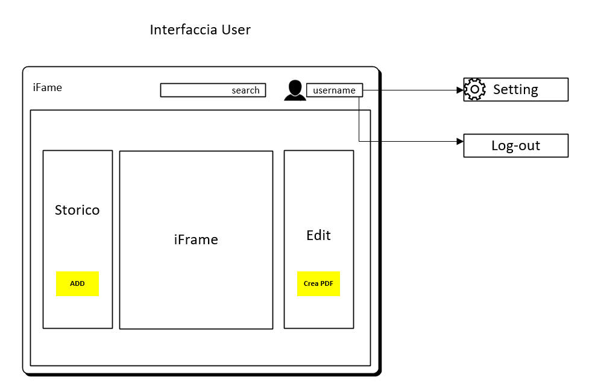

##### Carlo Bogani e Nico Ambrosini SAMT 02.12.2016

# Diario

## Lavori Svolti

Dalle ore 10:05 alle 12:20:  

È stato realizzato il diagramma di Gantt:

  

Carlo e Nico

In seguito, sono state create le necessarie tabelle per il realizzare
il sito Web, tutto ciò su PhpMyAdmin. fatto da Carlo.

Dalle ore 12:20 alle 15:00:    
Realizzazione del design appartenente al sito web, fatta da Carlo.

Interfaccia guest:

Interfaccia user:

Interfaccie iFrame della pagina:  

Nel mentre è stata cominciata anche la parte grafica del sito web, parte
iniziata da Nico.

Dalle ore 15:00 alle 15:45:   
È stato svolto il diario di oggi, da Carlo.

## Problemi Riscontrati

Non sono stati ricontrati problemi, oggi.

## Punto della situazione rispetto alla pianificazione

Siamo a buon punto.

## Programma di massima per la prossima giornata di lavoro

La prossima finiremo di realizzare la parte grafica.
