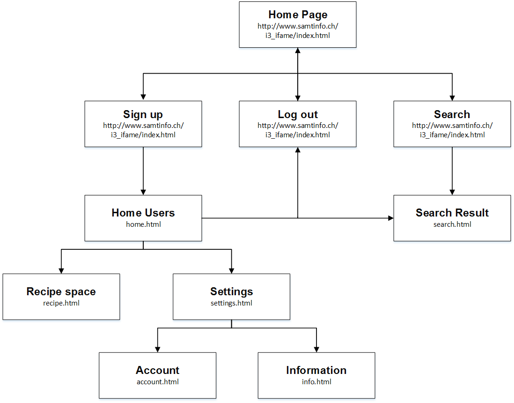
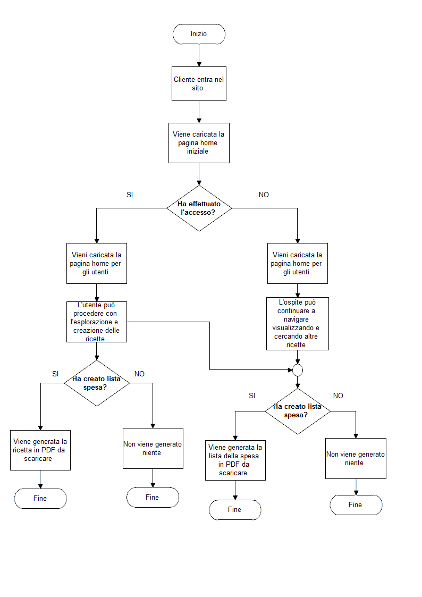

##### Carlo Bogani e Nico Ambrosini SAMT 13.01.2017

# Diario

## Lavori Svolti

Dalle ore 10:05 alle ore 12:20:

È stata ultimata l'interfaccia che riguarda la creazione di una ricetta ed è
stata continuata il documento di progettazione sul quale eravamo in ritardo,
tutto questo da Carlo.

Nel sito web è stata continuata la parte in background più precisamente
quella della ricerca, da Nico.

Dalle ore 13:15 alle 14:45:

È stato completato il documento contenente la documentazione per la fase
di progettazione ed è stata popolata la banca dati per eventuali prove svolte,
da Carlo.

Nico ha continuato con il lavoro svolto durante la mattinata.

Realizzazione del diagramma di flusso e sitemap (Carlo):

Dalle ore 15:00 alle 15:45:  
È stato svolto, da Carlo, il diario di oggi.

## Problemi Riscontrati

Non sono stati ricontrati problemi, oggi.

## Punto della situazione rispetto alla pianificazione

Siamo in ritardo sui i test da svolgere per l'applicazione web.

## Programma di massima per la prossima giornata di lavoro

La prossima volta si concluderà il progetto.
