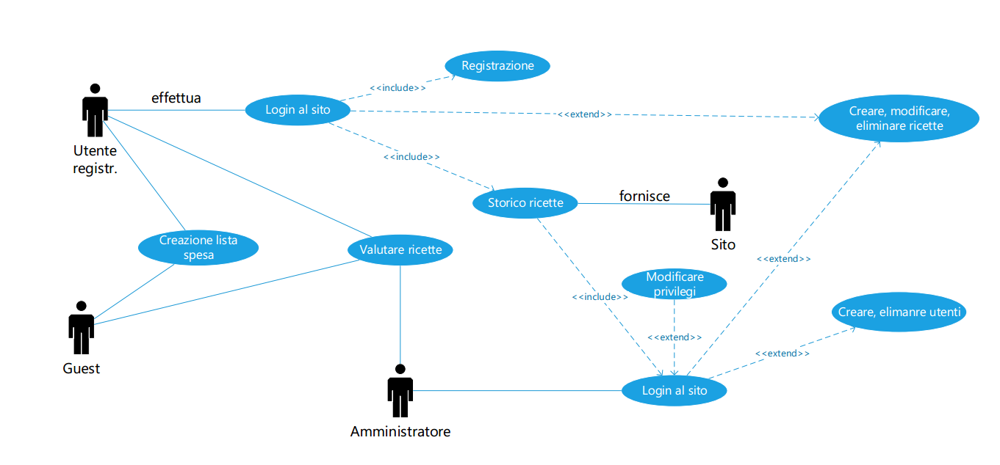
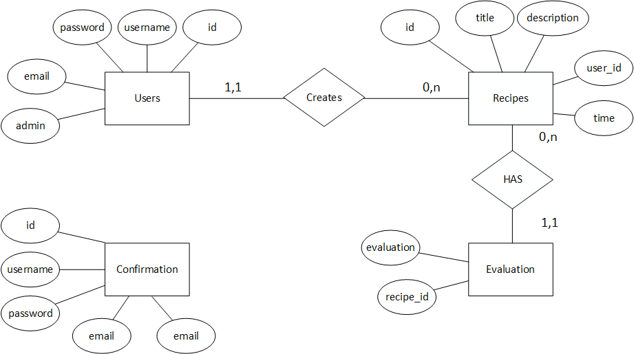

##### Carlo Bogani e Nico Ambrosini SAMT 25.11.2016

# Diario

## Lavori Svolti

Dalle ore 10:05 alle 10:50:  
Nella prima parte è stata svolta la teoria sulla Gestione dei rischi.

Dalle ore 10:50 alle 15:00:    
È stato reaizzato lo Use Case e lo schema E-R.

Use Case realizzato da Carlo:  

Schema E-R realizzato da Nico:

Dalle ore 15:00 alle 15:45:  
È stato svolto, da Carlo, il diario di oggi.

## Problemi Riscontrati

Non sono stati ricontrati problemi, oggi.

## Punto della situazione rispetto alla pianificazione

Non ci è stata ancora una pianificazione.

## Programma di massima per la prossima giornata di lavoro

La prossima realizzeremo il diagramma di Gantt.
