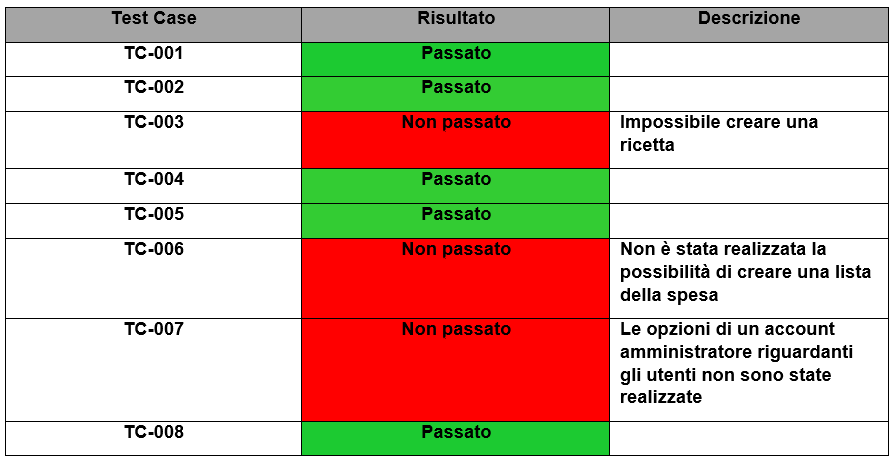

# Implementazione

1. [Introduzione](#introduzione)

  - [Informazioni sul progetto](#informazioni-sul-progetto)
1. [Implementazione](#implementazione)

1. [Test](#test)

  - [Protocollo di test](#protocollo-di-test)

  - [Risultati test](#risultati-test)

  - [Mancanze/limitazioni conosciute](#mancanze/limitazioni-conosciute)

1. [Consuntivo](#consuntivo)

1. [Conclusioni](#conclusioni)

  - [Sviluppi futuri](#sviluppi-futuri)

  - [Considerazioni personali](#considerazioni-personali)

1. [Sitografia](#sitografia)

1. [Allegati](#allegati)

## Introduzione

### Informazioni sul progetto

Scuola SAMT - Scuola arti e mestieri Trevano

Sezione: Informatica

Materia: Modulo 306

Allievi:

- Nico Ambrosini
- Carlo Bogani

Docente responsabile:

- Luca Muggiasca

Data di inizio: 28.10.2016

Data di fine: 20.01.2017

## Implementazione

### Realizzazione interfaccia grafica

### Log-in

### Gestione dati utenti

### Creazione ricette e lista della spesa

### Ricerca

## Test

### Protocollo di test

|Test Case      | TC-001                               |
|---------------|--------------------------------------|
|**Nome**       | Registrazione nel sito |
|**Riferimento**|REQ-002                              |
|**Descrizione**| |
|**Prerequisiti**| Interfaccia grafica e database  |
|**Procedura**| Recarsi nella pagina principale del sito e cliccare su Sign Up, in alto a destra; inserire un username, una password ed una email, confermare l'email tramite la conferma, infine effettuare il Login  |
|**Risultati attesi** |Accesso al sito, trovarsi nella pagina con uno storico |

|Test Case      | TC-002                               |
|---------------|--------------------------------------|
|**Nome**       | Login nel sito |
|**Riferimento**|REQ-002                              |
|**Descrizione**| |
|**Prerequisiti**| Interfaccia grafica e database  |
|**Procedura**| Recarsi nella pagina principale del sito e cliccare su Login, in alto a destra; inserire l'username e la password, premere invia |
|**Risultati attesi** |Accesso al sito, trovarsi nella pagina con uno storico, nessun messaggio di un Login errato |

|Test Case      | TC-003                              |
|---------------|--------------------------------------|
|**Nome**       | Creazione ricetta |
|**Riferimento**|REQ-003                             |
|**Descrizione**| |
|**Prerequisiti**| Interfaccia grafica e database  |
|**Procedura**| Accedere nel sito con il proprio account, e creare un ricetta, con il tasto ADD, riempiendo tutti i campi  |
|**Risultati attesi** | Trovare la propria ricetta creata e salvata nel proprio storico |

|Test Case      | TC-004                               |
|---------------|--------------------------------------|
|**Nome**       | Modifica ricetta |
|**Riferimento**|REQ-003                              |
|**Descrizione**| |
|**Prerequisiti**| Interfaccia grafica e database  |
|**Procedura**| Recarsi sulla ricetta da modificare, ed eseguire tutti i cambiamenti desiderati, alla fine salvare  |
|**Risultati attesi** | Visualizzare la ricetta modificata |

|Test Case      | TC-005                               |
|---------------|--------------------------------------|
|**Nome**       | Cancellazione ricetta |
|**Riferimento**|REQ-003                              |
|**Descrizione**| |
|**Prerequisiti**| Interfaccia grafica e database  |
|**Procedura**| Recarsi sulla ricetta da cancellare, ed eliminarla  |
|**Risultati attesi** | Ricetta scomparsa dallo storico |

|Test Case      | TC-006                               |
|---------------|--------------------------------------|
|**Nome**       | Ricerca nel sito |
|**Riferimento**|REQ-007                              |
|**Descrizione**| |
|**Prerequisiti**| Interfaccia grafica e database  |
|**Procedura**| Digitare una parola chiave desiderata nella barra di ricerca, in seguinto cliccare sul bottone Submit o premere ENTER  |
|**Risultati attesi** | Visualizzare delle ricette, sotto Search Results, che contengono la parola chiave ricercata |

|Test Case      | TC-007                               |
|---------------|--------------------------------------|
|**Nome**       | Opzioni amministratore |
|**Riferimento**|REQ-005                              |
|**Descrizione**| |
|**Prerequisiti**| Interfaccia grafica, database e account amministratore  |
|**Procedura**| Accedere nel sito con un account amministratore, andare su opzioni, eliminare e aggiungere un utente    |
|**Risultati attesi** | Le ricette del utente cancellato non devono esserci, nel database(Users) i campi sono scomparsi, mentre per l'utente aggiunto vi è un nuovo campo nel database |

### Risultati test

### Mancanze/limitazioni conosciute

## Consuntivo

Questo è il diagramma di Gantt consuntivo, viene dimostrato che ci è stato
un ritardo nella fase d'implementazione dell'applicativo, le attività che
sono durate più del previsto sono quelle messe in evidenza con il colore
azzurro. Abbiamo perso tempo sopratutto nel realizzare una interfaccia grafica
ideale per quanto riguarda la creazione di una ricetta. Un altro problema che
ha causato un ritardo è quello della gestione dei dati nel database.

## Conclusioni

Siamo molto soddisfatti del risultato ottenuto, anche se avevamo molte altre
idee da appliccare nel progetto ma però non siamo riusciti.
Nel corso di questo progetto siamo riusciti a dividerci al meglio il lavoro
da svolgere e quindi non sono state causate situazioni di confusione o di
disordine, anche se siamo rimasti un po indietro rispetto al piano di lavoro
da seguire(Gantt) perché abbiamo impiegato tanto tempo a realizzare la parte
"background" del sito; ma nonostante tutto siamo riusciti a recuperare senza molti
problemi.

### Sviluppi futuri

Non vi è nessuna intenzione di effettuare dei miglioramenti al progetto, in futuro.
Si ritiene che sia giusto mantenerlo nello stato corrente, chiaramente ad un sito web
si possono aggiungere tantissime nuove opzioni, perché esistono tantissime varianti
di perfezionamenti, in questo caso non lo riteniamo necessario.

### Considerazioni personali
Questo progetto mi è servito molto ad imparare come si realizza accuratamente un
sito, confronto a prima, adesso ho molto le idee più in chiaro su come realizzare ed organizzare il lavoro da svolgere per la creazione di un applicazione web.
Devo dire, sinceramente, che questo progetto è stato tanto di mio gradimento poiché si è dovuto lavorare con i liguaggi di programmazione e simili, a differenza del primo
progetto svolto. (Carlo)

PARTE NICO

## Bibliografia

### Sitografia

-   http://www.w3schools.com/, *Consigli programmazione*, 18-11-2016

-   http://www.ganttproject.biz/, *GanttProject*, 11-11-2016

-   http://logicnet.dk/DiagramDesigner/, *DiagramDesigner*, 02-12-2016

-   http://www.heidisql.com/download.php, *HeidiSQL*, 09-12-2016

-   https://products.office.com/en-us/visio/flowchart-software, *Microsoft Visio 2016*, 23-12-2016

## Allegati

-  Diari di lavoro

-  Mandato / Quaderno dei compiti

-  Codici sorgente

-  Prodotto

Alcuni di questi allegati sono recapitabili su GitHub al seguente indirizzo

https://github.com/Bogcar/iFame
