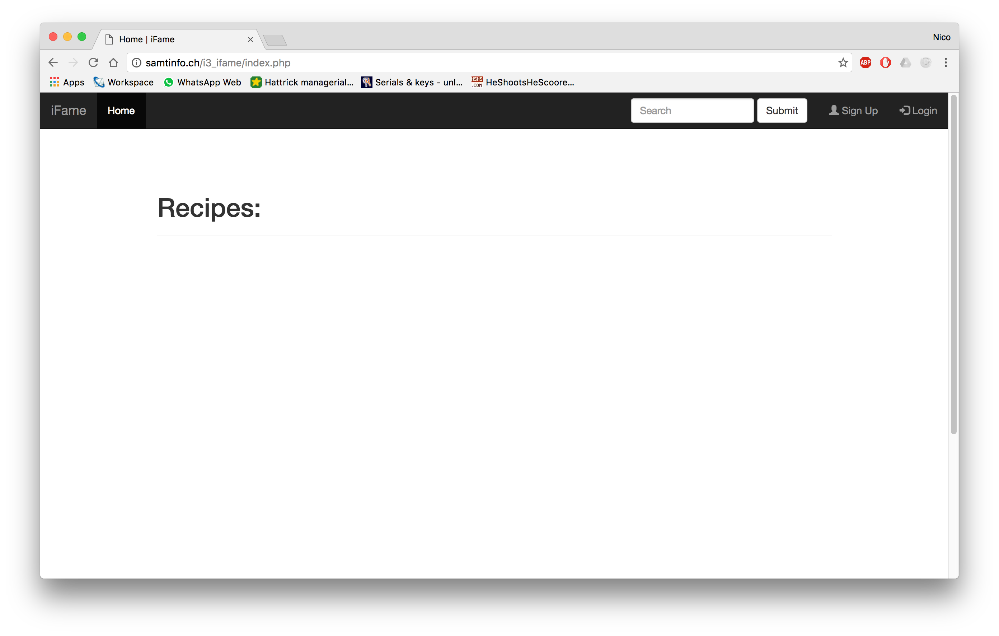

# Implementazione

1. [Introduzione](#introduzione)

  - [Informazioni sul progetto](#informazioni-sul-progetto)
1. [Implementazione](#implementazione)

1. [Test](#test)

  - [Protocollo di test](#protocollo-di-test)

  - [Risultati test](#risultati-test)

  - [Mancanze/limitazioni conosciute](#mancanze/limitazioni-conosciute)

1. [Consuntivo](#consuntivo)

1. [Conclusioni](#conclusioni)

  - [Sviluppi futuri](#sviluppi-futuri)

  - [Considerazioni personali](#considerazioni-personali)

1. [Sitografia](#sitografia)

1. [Allegati](#allegati)


## Introduzione

### Informazioni sul progetto

Scuola SAMT - Scuola arti e mestieri Trevano

Sezione: Informatica

Materia: Modulo 306

Allievi:

- Nico Ambrosini
- Carlo Bogani

Docente responsabile:

- Luca Muggiasca

Data di inizio: 28.10.2016

Data di fine: 20.01.2017

## Implementazione

### Index


Questa è la pagina principale, sui cui tutti gli utenti, registrati e non, possono accedere. In alto a destra troviamo il form di ricerca, il botton per aprire il modale della registrazione e il bottone per aprire il modale del login.

### Modale registrazione


Questo è il modale per la registrazione. Per registrarsi è necessario inserire: username, e-mail, password e la conferma della password. Una volta registrati, si riceverà un'email con il link per l'attivazione dell'account.

### Modale login


Questo è invece il modale del login in cui si deve inserire: username o e-mail e la password.

### Home


Questa è la homepage accessibile solo agli autenti registrati. È simile alla pagina accessibile a tutti tranne per un paio di cose. Al posto dei bottoni si "Sign Up" e "Sign In" ce n'è uno per il logout e accanto alle ricette c'è lo storico delle ricette create dall'utente. Un'altra cosa che cambia è il bottone verde in cima a sinistra, quest'ultimo serve per aprire il form dove inserire le ricette.

### Aggiungere le ricette


Quando si preme sul tasto verde in alto a sinistra, nel frame si carica la pagina con il form per aggiungere le ricette. In questo form vanno inseriti: titolo, tempo di preparazione, una descrizione, gli ingredienti e la procedura da eseguire per fare la ricetta.

### Visualizzare le ricette


Quando si clicca sul titolo di una ricetta si apre la seguente pagina che, caricando le informazioni da un file xml, le stampa aschermo in modo che gli utenti possano vederle. Inoltre ci sono due valutazioni (con le stelle), la prima mostra la media di stelle della ricetta, quella in fondo permette di valutare la ricetta semplicemente cliccando sul numero di stelle desiderate. In più vi sono 3 bottoni: il primo serve per modificare la ricetta, il secondo per eliminarla e il terzo mostra il pdf (stampabile) con la lista della spesa.

> Per implementare questo progetto ho creato dapprima tre classi: Recipe, StringToArray e xml.

### Recipe

La prima classe è la classe Recipe.

```
class Recipe {
            private $title = "";

            private $time = 0;

            private $description = "";

            private $procedure = array();

            private $ingredients = array();

            public function __construct($title, $time, $description, $ingredients, $procedure) {
                    $this->title = $title;
                    $this->time = $time;
                    $this->description = $description;

                    $ita = new StringToArray();
                    $this->procedure = $ita->convert($procedure);
                    $this->ingredients = $ita->convert($ingredients);
            }

            public function getTitle() {
                    return $this->title;
            }

            public function getTime() {
                    return $this->time;
            }

            public function getDescription() {
                    return $this->description;
            }

            public function getIngredients() {
                    return $this->ingredients;
            }

            public function getProcedure() {
                    return $this->procedure;
            }
    }
```

Questa classe serve per creare un oggetto ricetta con tutti i componenti, così da rendere più semplice la manipolazione dei dati. I 5 attributi sono:
- title: il titolo della ricetta -> stringa
- time: il tempo di preparazione -> intero
- description: la descrizione -> stringa
- ingredients: gli ingredienti -> array di stringhe
- procedure: le procedure per completare la ricetta -> array di stringhe

La particolarità di questa classe è che `$ingredients`e `$procedure` vengono passati all'oggetto come stringhe, poi nel costruttore, grazie alla classe `StringToArray`, mostrata in seguito, vengono convertiti in un array si stringhe.

### StringToArray

La classe `StringToArray` serve per convertire una stringa in un array di stringhe.

```
class StringToArray
    {
        public function convert($s)
        {
            $arr = array();

            foreach (preg_split("/\n/", $s) as $line) {
                array_push($arr, $line);
            }

            return $arr;
        }
    }
```

Questa classe è composta solo da un metodo, che prende una stringa come argomento. Il metodo convert prende la stringa, ne separa le singole righe e le mette nell'array `$arr`che verrà poi ritornato.

### xml
Di queste tre classi, la classe xml è forse la più importante dato che permette di salvare i dati nei file xml.

```
class xml {
                private $XML_DEFAULT = [
                        "start" => "<?xml version='1.0' encoding='UTF-8'?>",
                        "recipes" => "<recipes>",
                        "endRecipes" => "</recipes>",
                        "recipe" => "<recipe",
                        "endRecipe" => "</recipe>",
                        "description" => "<description>",
                        "endDescription" => "</description>",
                        "time" => "<time>",
                        "endTime" => "</time>",
                        "procedures" => "<procedures>",
                        "endProcedures" => "</procedures>",
                        "procedure" => "<procedure>",
                        "endProcedure" => "</procedure>",
                        "ingredients" => "<ingredients>",
                        "endIngredients" => "</ingredients>",
                        "ingredient" => "<ingredient>",
                        "endIngredient" => "</ingredient>"
                ];

                private $recipe = "";

                private $filepath = "";

                public function __construct($recipe, $filename) {
                        $this->recipe = $recipe;
                        $this->filepath = "../usersData/" . $filename . ".xml";
                }

                public function createRecipesXML() {
                    if (!file_exists($this->filepath)) {
                        $file = fopen($this->filepath, "x+");
                        $txt = $this->XML_DEFAULT["start"] . "\n" .
                            $this->XML_DEFAULT["recipes"] . "\n" .
                            $this->XML_DEFAULT["endRecipes"];
                        fwrite($file, $txt);
                        fclose($file);
                    }
                }

                public function writeRecipe() {
                        $this->createRecipesXML();
                        $lines = file($this->filepath);

                        for ($x = 0; $x <= count($lines) - 2; $x++) {
                                $textBefore = $textBefore . $lines[$x];
                        }

                        $txt = "\t" . $this->XML_DEFAULT["recipe"] . " title='" . $this->recipe->getTitle() . "'>\n" .
                                "\t\t" . $this->XML_DEFAULT["time"] . $this->recipe->getTime() . $this->XML_DEFAULT["endTime"] . "\n" .
                                "\t\t" . $this->XML_DEFAULT["ingredients"] . "\n";

                        foreach ($this->recipe->getIngredients() as $ing) {
                            $txt = $txt . "\t\t\t" . $this->XML_DEFAULT["ingredient"] . $ing . $this->XML_DEFAULT["endIngredient"] . "\n";
                        }

                        $txt = $txt . "\t\t" . $this->XML_DEFAULT["endIngredients"] . "\n" .
                                "\t\t" . $this->XML_DEFAULT["description"] . $this->recipe->getDescription() . $this->XML_DEFAULT['endDescription'] . "\n" .
                                "\t\t" . $this->XML_DEFAULT["procedures"] . "\n";

                        foreach ($this->recipe->getProcedure() as $pro) {
                            $txt = $txt . "\t\t\t" . $this->XML_DEFAULT["procedure"] . $pro . $this->XML_DEFAULT["endProcedure"] . "\n";
                        }
                        $txt = $txt . "\t\t" . $this->XML_DEFAULT["endProcedures"] . "\n" .
                                "\t" . $this->XML_DEFAULT["endRecipe"] . "\n" .
                                $this->XML_DEFAULT["endRecipes"];

                        $textBefore = $textBefore . $txt;

                        $myFile = fopen($this->filepath, "r+");
                        fwrite($myFile, $textBefore);

                }
        }
```

Prima di tutto, ho dichiarato un array con i vari tag del file xml. Nel costruttore vengono salvati un oggetto `Recipe` e il filename, ovvero il nome del file. In questo caso per il nome del file verrà passato il nome utente del creatore della ricetta.
Il metodo `createRecipesXML()` è colui che controlla che il file esista e che, se non esiste, lo crea e inserisce i tag principali.
`writeRecip()` invece è il metodo che, in base ai valori dell'oggetto `Recipe`, aggiunge la ricetta al file.

--

> Il resto del codice PHP del progetto è quasi tutto simile: lettura o inserimento dei dati nel database. Ho scritto però un paio di metodi molto utili per inserire, modificare e cancellare i dati dai file xml.

Il primo metodo è `_getRecipe()` che serve a leggere i dati dai file xml.

```PHP
	function _getRecipe() {
		...
		$xml = simplexml_load_file("../usersData/" . $username . ".xml") or
            die("Error: Cannot open file");

        foreach ($xml->children() as $recipes) {
            if ($recipes['title'] == $title) {

                foreach($recipes->ingredients->ingredient as $ing) {
                    $ingredients = $ingredients . $ing . "\n";
                }

                foreach($recipes->procedures->procedure as $pro) {
                    $procedures = $procedures . $pro . "\n";
                }

                $r = new Recipe($title, $time, $description, $ingredients, $procedures);

                return $r;
            }
        }
```

Questa è la parte fondamentale del metodo. Usando un metodo presente nella libreria di PHP5, leggo i dati dai file xml. Dai file leggo però solo gli ingredienti e la procedura, poichè il resto è già presente nel database. Per fare in modo che possano essere trasformati in array nella classe Recipe, li leggo uno ad uno e li aggiungo alle rispettive stringhe con `\n`, per mandare a capo il dato seguente.

--

Un'altro metodo interessante e molto importante è quello che serve ad eliminare le ricette. Come il precedente, uso i file xml, ma questo è un'altro metodo, sempre dalla libreria di PHP5, per manipolare il file xml: il DOM.

```PHP
function _removeRecipe() {
	...
	$doc = new DOMDocument;
	$doc->load($filepath);
	
	$theDocument = $doc->documentElement;
	
	$list = $theDocument->getElementsByTagName('recipe');
	
	foreach ($list as $domElement) {
		$attrValue = $domElement->getAttribute('title');
		if ($attrValue == $recipeTitle) {
		    $nodeToRemove = $domElement;
		}
	}
	
	if ($nodeToRemove != null) {
		$theDocument->removeChild($nodeToRemove);
		
		$sql = "DELETE FROM Recipes WHERE id = " . $recipeId;

		if(!$conn->query($swl)) {
			echo $conn->error;
		}
		
		$file = fopen($filepath, "w");
		fwrite($file,$doc->saveXml());
		fclose($file);
	}
}
```

Questo metodo serve appunto a rimuovere la ricetta dal file xml. In pratica si crea un nuovo `DOMDocument`, si carica il file xml, dopodiche si va a cercare l'elemento desiderato (attraverso l'attributo `title` che corrisponde al titolo nel database. Una volta trovato l'elemento lo si salva per poi rimuoverlo, una volta rimosso si rimuove anche dal database e la ricetta non esiste più.

--

L'ultima parte di codice importante è la query di ricerca. Ho fatto in modo che l'utente, inserendo il testo, potesse cercare tra il titolo, la descrizione, il tempo e la valutazione. Le query sono le seguenti:

```
if (is_numeric($search)) {
        $sql = "SELECT * FROM Recipes WHERE time = " . $search . " OR id IN" .
        " (SELECT recipe_id FROM Evaluation HAVING avg(Evaluation) >= " .
        $search - 0.5 . " OR avg(Evaluation) <= " . $search + 0.5 . ")";
    } else {
        $sql = "SELECT * FROM Recipes WHERE title LIKE '%" . $search . "%' OR" .
        " description LIKE '%" . $search . "%'";
    }
```

Per prima cosa serve che controlli se si tratta di testo o di numeri, altrimenti la query non funzionerebbe, se è un numero esegue a prima altrimenti esegue la seconda.
La prima seleziona tutte le ricette con il tempo uguale al valore inserito oppure al valore della valutazione media (valore che cambia tra -0.5 dal valore immesso a +0.5). La seconda invece controlla che la parola sia presente nel titolo o nella descrizione;
## Test

### Protocollo di test

|Test Case      | TC-001                               |
|---------------|--------------------------------------|
|**Nome**       | Registrazione al sito |
|**Riferimento**|REQ-002                              |
|**Descrizione**| |
|**Prerequisiti**| Interfaccia grafica e database  |
|**Procedura**| Recarsi nella pagina principale del sito e cliccare su Sign Up, in alto a destra; inserire: username, password, la conferma della password e l'email, infine cliccare il bottone "Submit" in fondo al modale.  |
|**Risultati attesi** | Messaggio con scritto "Confirmation link sent" o, se l'account esiste già, un messaggio con sfondo rosso con scritto "Failure! Use another username or email"|

|Test Case      | TC-002                               |
|---------------|--------------------------------------|
|**Nome**       | Attivazione account |
|**Riferimento**|REQ-002                              |
|**Descrizione**| |
|**Prerequisiti**| Email e database  |
|**Procedura**| Una volta registrati recarsi nel proprio client mail o sulla propria mail sul browser, controllare l'arrivo di una mail da "no-reply@ifame.ch" e cliccare sul link ricevuto. Si verrà poi reindirizzati sulla pagina principale del sito.|
|**Risultati attesi** | Massaggio con scritto "Account successfully created! |

|Test Case      | TC-003                               |
|---------------|--------------------------------------|
|**Nome**       | Login al sito |
|**Riferimento**|REQ-002                              |
|**Descrizione**| |
|**Prerequisiti**| Interfaccia grafica e database  |
|**Procedura**| Recarsi nella pagina principale del sito e cliccare su Login, in alto a destra; inserire username e password, premere "Submit" in fondo al modale. |
|**Risultati attesi** | Si viene rediretti sulla pagina "home.php" e verrà mostrato lo storico con le ricette create dall'utente e altre ricette sulla destra. |

|Test Case      | TC-004                              |
|---------------|--------------------------------------|
|**Nome**       | Creazione ricetta |
|**Riferimento**|REQ-003                             |
|**Descrizione**| |
|**Prerequisiti**| Interfaccia grafica, database e account  |
|**Procedura**| Accedere al sito con un account, cliccare sul tasto verde situato in alto a sinistra, riempire i campi e cliccare su "Submit".|
|**Risultati attesi** | La ricetta verrà mostrata in fondo alle altre, nella colonna "Storico" |

|Test Case      | TC-005                               |
|---------------|--------------------------------------|
|**Nome**       | Modifica ricetta |
|**Riferimento**|REQ-003                              |
|**Descrizione**| |
|**Prerequisiti**| Interfaccia grafica, database e account  |
|**Procedura**| Cliccare sul titolo di una propria ricetta, nella colonna storico. Si apriranno i dati della ricetta. In fondo ai dati ci sono tre tre bottoni, cliccare su modifica. Nella nuova pagina aperta modificare i dati che ci sono all'interno dei campi e, una volta modificati cliccare su "Submit"|
|**Risultati attesi** | Visualizzare la ricetta modificata |

|Test Case      | TC-006                               |
|---------------|--------------------------------------|
|**Nome**       | Cancellazione ricetta |
|**Riferimento**|REQ-003                              |
|**Descrizione**| |
|**Prerequisiti**| Interfaccia grafica, database e account  |
|**Procedura**| Cliccare sul titolo di una propria ricetta, nella colonna storico. Si apriranno i dati della ricetta. In fondo ai dati ci sono tre tre bottoni, cliccare su delete. |
|**Risultati attesi** | Ricetta scomparsa dallo storico |

|Test Case      | TC-007                               |
|---------------|--------------------------------------|
|**Nome**       | Creazione lista spesa |
|**Riferimento**|REQ-004                              |
|**Descrizione**| |
|**Prerequisiti**| Interfaccia grafica e database  |
|**Procedura**| Cliccare sul titolo della ricetta. In fondo alla nuova pagina aperta cliccare sul bottone "LISTA SPESA". |
|**Risultati attesi** | Anteprima del PDF e possibilità di dowload. |

|Test Case      | TC-008                               |
|---------------|--------------------------------------|
|**Nome**       | Ricerca nel sito |
|**Riferimento**|REQ-007                              |
|**Descrizione**| |
|**Prerequisiti**| Interfaccia grafica e database  |
|**Procedura**| Nella barra di navigazione, nella cella di inserimento del testo, inserire una parola chiave.  |
|**Risultati attesi** | Nella colonna di sinistra devono mostrarsi le ricette contenenti quella parola nel titolo o nella descrizione. |

### Risultati test


### Mancanze/limitazioni conosciute

Le mancanze e limitazioni principali del prodotto finale sono:

- L'opzione di creare una lista della spesa

- Gestione account dagli utenti amministratori

- Problemi riguardanti la creazione, modifica e cancellazione di una ricetta.

Per quanto concerne la lista della spesa, una parte molto importante del sito,
non si è potuta sviluppare perché è stato dedicato più tempo del dovuto alle altre attività e di conseguenza il tempo per realizzare tutto il necessario non era sufficiente.

Stessa situazione descritta sopra per la parte degli account con il compito di amministrare.

Infine, per la ricetta ci è stato un incidente causato da disattenzione, un file presente nel server è stato sovrascritto, di conseguenza del lavoro è andato perso.
Per colpa di quest'ultimo accaduto, è stata dovuta rifare questa parte, ma nel file
sovrascritto tutte le parti non erano pienamente funzionanti.

C'era l'intenzione di dare la possibilità di integrare il download di documenti
PDF nell'applicazione.

Inoltre la creazione delle ricette, inizialmente funzionante, alla consegna non funzionava poichè la pagina all'interno del frame non riceve le variabili di sessione.

Non è proprio una mancanza ma durante l'implementazione abbiamo notato che l'interfaccia era meglio organizzarla in altri modi rispetto a quelli pensati inizialmente, anche se il risultato finale è molto simile.

## Consuntivo


Questo è il diagramma di Gantt consuntivo, viene dimostrato che ci è stato
un ritardo nella fase d'implementazione dell'applicativo, le attività che
sono durate più del previsto sono quelle messe in evidenza con il colore
azzurro. Abbiamo perso tempo sopratutto nel realizzare una interfaccia grafica
ideale per quanto riguarda la creazione di una ricetta. Un altro problema che
ha causato un ritardo è quello della gestione dei dati nel database.

| Costi orari   | 50.-                |
|---------------|---------------------|
| Lavoratori    | 2 persone           |
| Ore di lavoro | 40 ore              |
|**Totale**     | 2'400.-             |

## Conclusioni

Poichè di PHP abbiamo fatto poco o niente, siamo molti soddisfatti di dove siamo riusciti ad arrivare con le nostre conosce. Purtroppo il progetto è completo per metà e mancano un paio di cose importandi. Siamo riusciti bene a dividerci il lavoro e quindi non è mai capitato che qualcuno rimanesse senza far niente. Poichè, appunto, siamo appena entrati nel mondo di PHP, molte volte capitava che non facesse ciò che si sperava ma alla fine siamo sempre riusciti a risolvere, tra cui la maggior parte delle volte senza aiuti esterni.

### Sviluppi futuri

Non vi è nessuna intenzione di effettuare dei miglioramenti al progetto, in futuro.
Si ritiene che sia giusto mantenerlo nello stato corrente, chiaramente ad un sito web
si possono aggiungere tantissime nuove opzioni, perché esistono tantissime varianti
di perfezionamenti, in questo caso non lo riteniamo necessario.

### Considerazioni personali
Questo progetto mi è servito molto ad imparare come si realizza accuratamente un
sito, in confronto a prima, adesso ho le idee molto più in chiaro su come realizzare ed organizzare il lavoro da svolgere per la creazione di un applicazione web.
Devo dire, sinceramente, che questo progetto è stato tanto di mio gradimento poiché si è dovuto lavorare con i liguaggi di programmazione e simili, a differenza del primo
progetto svolto. (Carlo)

Purtroppo che a scuola non ho ancora fatto PHP, lo abbiamo visto di sfuggita a fine seconda ma giusto le cose basiche. Quando ci è stato dato questo progetto ero molto contento e ho scoperto che PHP ha moltissimo potenziale. Purtroppo che non mi piace molto come linguaggio poiché la maggior parte delle volte, quando c'è un errore o non fa ciò che si vuole, non si capisce dove si devono mettere le mani perchè poco chiare le spiegazioni. Perciò concludo dicendo che il progetto era carino, ma che preferisco programmare applicazioni stand-alone piuttosto che siti web. (Nico)

## Bibliografia

### Sitografia

-   http://www.ganttproject.biz/, *GanttProject*, 11.11.2016
-   http://www.w3schools.com/, *Consigli programmazione*, 18.11.2016
-   http://plugins.krajee.com/star-rating, *Star rating Bootstrap*, 25.11.2016
-   http://logicnet.dk/DiagramDesigner/, *DiagramDesigner*, 02.12.2016
-   http://www.heidisql.com/download.php, *HeidiSQL*, 09.12.2016
-   https://products.office.com/en-us/visio/flowchart-software, *Microsoft Visio 2016*, 23.12.2016
-   http://getbootstrap.com/, *Bootstrap3*, 11.11.2016
-   http://jquery.com/, *JQuery*, 11.11.2016
-   http://stackoverflow.com/, *Stackoverflow*, 11.11.2016-20.01.2017
-   http://www.w3schools.com/, *W3Schools*, 11.11.2016-20.01.2017


## Allegati

-  Diari di lavoro

-  Mandato / Quaderno dei compiti

-  Codici sorgente

-  Prodotto

Alcuni di questi allegati sono recapitabili su GitHub al seguente indirizzo

https://github.com/Bogcar/iFame

Il sito web è stato caricato sul server samtinfo al seguente indirizzo:

http://samtinfo.ch/i3_ifame