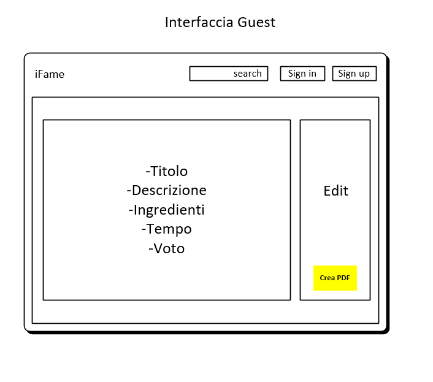
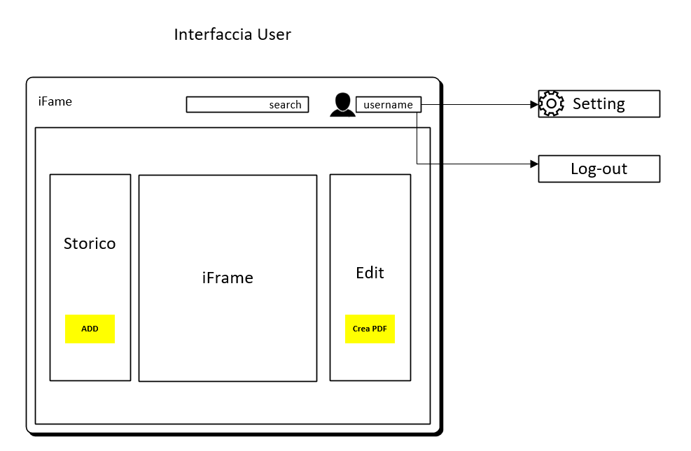
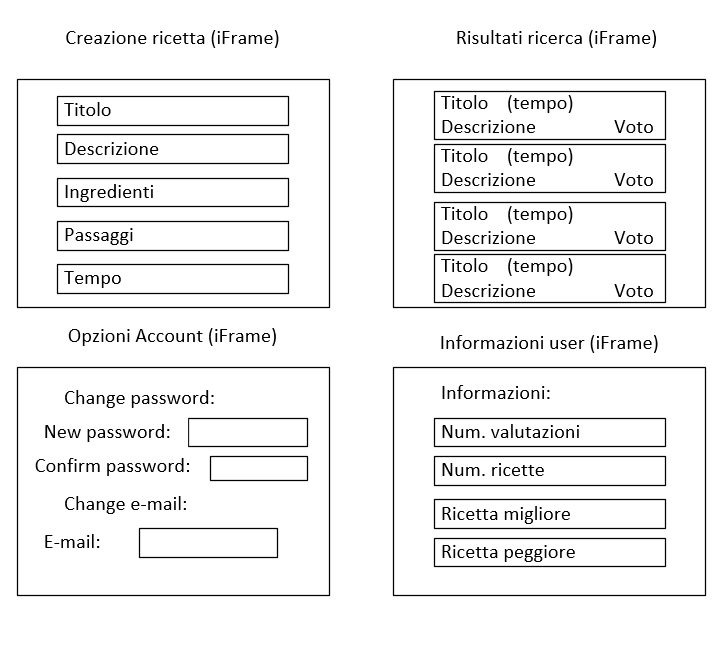
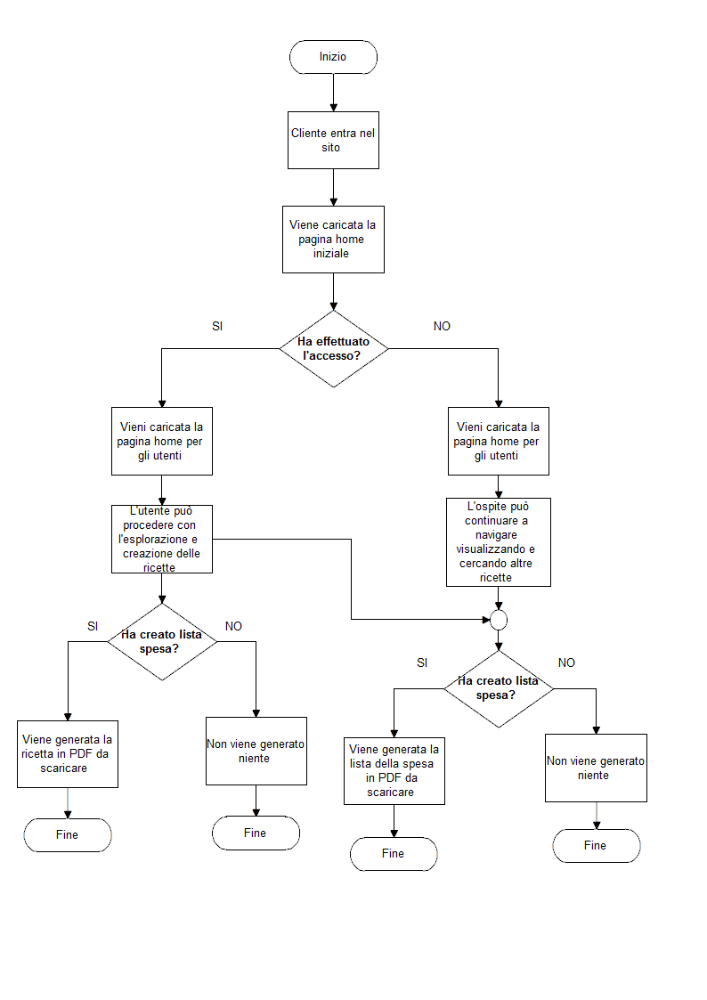

# Progettazione

1. [Introduzione](#introduzione)

  - [Informazioni sul progetto](#informazioni-sul-progetto)

  - [Abstract](#abstract)

  - [Scopo](#scopo)

1. [Analisi](#analisi)

  - [Analisi del dominio](#analisi-del-dominio)

  - [Analisi e specifica dei requisiti](#analisi-e-specifica-dei-requisiti)

1. [Use case](#use-case)

  - [Pianificazione](#pianificazione)

  - [Analisi dei mezzi](#analisi-dei-mezzi)

1. [Progettazione](#progettazione)

  - [Design dell’architettura del sistema](#design-dell’architettura-del-sist)

  - [Schema E-R, schema logico e descrizione](#schema-er-logico-desc)

  - [Design delle interfacce](#design-interfaces)

  - [Design procedurale](#desgin-procedurale)

## Introduzione

### Informazioni sul progetto

Scuola SAMT - Scuola arti e mestieri Trevano

Sezione: Informatica

Materia: Modulo 306

Allievi:

- Nico Ambrosini
- Carlo Bogani

Docenti responsabili:

- Luca Muggiasca

Data di inizio: 28.10.2016

Data di fine: 20.01.2017

### Abstract

  > The books of coocking are very present in kitchens, but   
  > sometimes those can be cumbersome.
  > For solve this problem there is the use of tecnology,   
  > some people use tablets, mobile phone, etc.
  > We were requested to realize a site of recipes's management.

### Scopo
Lo scopo di questo progetto è quello di sviluppare un'applicazione web per
offrire il consulto delle ricette di altri e la gestione delle
proprie.
Oltretutto, si dovrà dare la possibilità di registrasi in modo da creare
delle nuove ricette in modo da farsele valutare da tutti i visitatori,
oltre a quest'ultima vi è pure quella di generare la propria lista della spesa
in base alla ricetta che si sta consultando.

## Analisi

### Analisi del dominio  

Il tipico problema che si ha nelle cucine è quello della scelta e lo svolgimento
di una ricette, molto spesso per ovviare questo problema si procede con
l'acquisto di un libro di ricette. Ma al giorno d'oggi la tecnologia ha preso
il sopravvento e di conseguenza nelle case i libri vengono poco usati.

Per risolvere il tutto si opta per vedere e seguire le ricette
di prorio interesse su un classico smartphone o tablet, la navigazione
in internet è molto diffusa in tutto il mondo e non richiede conoscenze
particolari.

Il prodotto si potrà utilizzare tranquillamente senza nessun ostacolo,
vi è anche la possibilità di condivere le proprie ricette, in modo da
rendere più entusiasmante la creazione di un piatto.

### Analisi e specifica dei requisiti

|ID  |REQ-001                                         |
|----|------------------------------------------------|
|**Nome**    |Pagina web|
|**Priorità**|1                     |
|**Versione**|1.0                   |
|**Note**    ||
|            |**Sotto requisiti** |
|**001**      | Login |
|**002**      | Database |

|ID  |REQ-002                                         |
|----|------------------------------------------------|
|**Nome**    |Registrazione|
|**Priorità**|1                     |
|**Versione**|1.0                   |
|**Note**    ||
|            |**Sotto requisiti** |
|**001**      | Inserire dati personali (username, password, email) |
|**002**      | Verifica email |

|ID  |REQ-003                                      |
|----|------------------------------------------------|
|**Nome**    |Ricette|
|**Priorità**|1                     |
|**Versione**|1.0                   |
|**Note**    ||
|            |**Sotto requisiti** |
|**001**      | Lista ingredienti (titolo, descrizione, passaggi, difficoltà, tempistica, valutazione) |
|**002**      | Consultabile da chiunque |

|ID  |REQ-004                                         |
|----|------------------------------------------------|
|**Nome**    |Utente|
|**Priorità**|1                     |
|**Versione**|1.0                   |
|**Note**    ||
|            |**Sotto requisiti** |
|**001**      | Creare, eliminare e modificare ricette |
|**002**      | Storico ricette |
|**003**      | Valutare ricette |
|**004**      | Creazione lista spesa |

|ID  |REQ-005                                         |
|----|------------------------------------------------|
|**Nome**    |Amministratore|
|**Priorità**|1                     |
|**Versione**|1.0                   |
|**Note**    ||
|            |**Sotto requisiti** |
|**001**      | Aggiungere ed eliminare utenti |
|**002**      | Modificare privilegi (amministrativi) utenti |

|ID  |REQ-006                                         |
|----|------------------------------------------------|
|**Nome**    |Guest|
|**Priorità**|1                     |
|**Versione**|1.0                   |
|**Note**    ||
|            |**Sotto requisiti** |
|**001**      | Deve visualizzare le ricette in sola lettura |
|**002**      | Valutare ricette |
|**003**      | Creazione lista spesa |

|ID  |REQ-007                                         |
|----|------------------------------------------------|
|**Nome**    |Ricerca|
|**Priorità**|1                     |
|**Versione**|1.0                   |
|**Note**    ||
|            |**Sotto requisiti** |
|**001**      | Parole chiave |
|**002**      | Parametri (titolo, valutazioni, difficoltà, tempo) |

### Use case

In questo schema abbiamo rappresentato tutti i rispettivi casi del progetto.

### Pianificazione

Le attività evidenziate di colore verde nel diagramma di Ganttt,
sono in parallelo.

### Analisi dei mezzi

Questo prodotto verrà messo su un web server.   

I mezzi per realizzare il tutto sono i seguenti:

- Apache: usato per ospitare il sito

- PhpMyAdmin: usato per la gestione del database e le sue tabelle

- MySql: usato per la gestione dei dati nelle tabelle

- Linguaggi HTML e CSS: utilizzati per l'interfaccia grafica

- Linguaggi Php, MySQL, JavaScript: utilizzati per la gestione del sito

- Microsoft Visio 2016: usato per realizzare alcuni schemi, recapitabile
nel seguente sito https://products.office.com/en-us/visio/flowchart-software

- Heidi SQL 9.4.0 : usato per prove del database in locale, scaricabile
 gratuitamente da 
http://www.heidisql.com/download.php

- Diagram Designer 1.28 : usato per il diagramma di flusso, scaricabile da http://logicnet.dk/DiagramDesigner/

- 2 PC: usati per svolgere il tutto

## Progettazione

### Design dell’architettura del sistema  

Questo è il sitemap del sito web, questo comprende tutti i file che
costituiscono l'interfaccia grafica.   
È stato realizzato con Visio 2016, è stato preso uno spunto da internet
poiché non era mai stata realizzata una mappa simile.

### Schema E-R, schema logico e descrizione.

Nello schema sono rappresentate tutte le relazioni tra le varie tabelle.

### Design delle interfacce  

  

Questa è l'interfaccia grafica che un visitatore non registrato avrà, appena
entrato nel sito.  
È stato preso lo spounto dai vari siti online.  
Come si può notare è suddiviso in due parti, quella a sinistra è utlizzata per
una sorta di home in cui vengono mostrate varie ricette presenti nel sito,
invece su quella di destra vi è una spazio per generare la propria lista della
spesa che sarà poi scaricata in formato PDF.

Questa è l'interfaccia di un utente registrato, appena eseguito il login.  
L'utilizzatore potrà entrare nelle opzioni legate al suo account ed ovviamente
fare un Log-out.  
Nella pagina principale vi si troverà uno spazio apposito in cui poter
creare la propria ricette inserendo i dati negli spazi predefiniti.

Qua sotto mostrati le finestre che potranno apparire nel iFrame in mezzo
del utente:

- In alto a sinistra è presente la schermata su cui creare la propria ricette,
questa contiene degli spazi predefiniti in cui immettere il necessario.

- In alto a destra, invece, si trova l'interfaccia che si visualizzerà una volta
effettuata la ricerca di una ricetta, ogni ricette verrà identificata da titolo,
temmpo, descrizione e voto.

- In basso a sinistra è situato lo spazio dedicato alle impostazioni dell'utente,
in quest'ultimo si avrà la possibilità di cambiare la password e l'e-mail.

- In basso a destra, come ultimo, è presente una schermata appartenente all'
utente dove potrà visualizzare le statistiche delle sue ricette create.

### Design procedurale

Questo diagramma di flusso rappresenta solo un caso semplice che si verifica,
ovvero quando un cliente entra nel sito ed esegue le azioni solo per una volta
soltanto.
