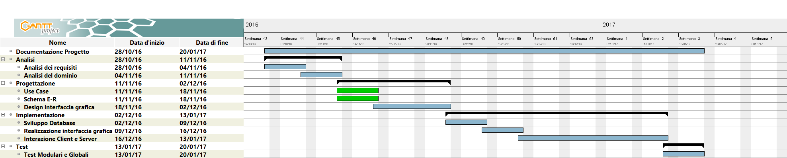

1. [Introduzione](#introduzione)

  - [Informazioni sul progetto](#informazioni-sul-progetto)

  - [Abstract](#abstract)

  - [Scopo](#scopo)

1. [Analisi](#analisi)

  - [Analisi del dominio](#analisi-del-dominio)

  - [Analisi e specifica dei requisiti](#analisi-e-specifica-dei-requisiti)

1. [Use case](#use-case)

  - [Pianificazione](#pianificazione)

  - [Analisi dei mezzi](#analisi-dei-mezzi)

1. [Progettazione](#progettazione)

  - [Design dell’architettura del sistema](#design-dell’architettura-del-sistema)

  - [Design dei dati e database](#design-dei-dati-e-database)

## Introduzione

### Informazioni sul progetto

Scuola SAMT - Scuola arti e mestieri Trevano

Sezione: Informatica

Materia: Modulo 306

Allievi:

- Nico Ambrosini
- Carlo Bogani

Docenti responsabili:

- Luca Muggiasca

Data di inizio: 28.10.2016

Data di fine: 20.01.2017

### Abstract

  E’ una breve e accurata rappresentazione dei contenuti di un documento,
  senza notazioni critiche o valutazioni. Lo scopo di un abstract efficace
  dovrebbe essere quello di far conoscere all’utente il contenuto di base
  di un documento e metterlo nella condizione di decidere se risponde ai
  suoi interessi e se è opportuno il ricorso al documento originale.

  Può contenere alcuni o tutti gli elementi seguenti:

  -   **Background/Situazione iniziale**

  -   **Descrizione del problema e motivazione**: Che problema ho cercato
      di risolvere? Questa sezione dovrebbe includere l'importanza del
      vostro lavoro, la difficoltà dell'area e l'effetto che potrebbe
      avere se portato a termine con successo.

  -   **Approccio/Metodi**: Come ho ottenuto dei progressi? Come ho
      risolto il problema (tecniche…)? Quale è stata l’entità del mio
      lavoro? Che fattori importanti controllo, ignoro o misuro?

  -   **Risultati**: Quale è la risposta? Quali sono i risultati? Quanto è
      più veloce, più sicuro, più economico o in qualche altro aspetto
      migliore di altri prodotti/soluzioni?

  Esempio di abstract:

  > *As the size and complexity of today’s most modern computer chips
  > increase, new techniques must be developed to effectively design and
  > create Very Large Scale Integration chips quickly. For this project, a
  > new type of hardware compiler is created. This hardware compiler will
  > read a C++ program, and physically design a suitable microprocessor
  > intended for running that specific program. With this new and powerful
  > compiler, it is possible to design anything from a small adder, to a
  > microprocessor with millions of transistors. Designing new computer
  > chips, such as the Pentium 4, can require dozens of engineers and
  > months of time. With the help of this compiler, a single person could
  > design such a large-scale microprocessor in just weeks.*

### Scopo

Lo scopo del progetto è di creare un'applicazione web per la gestione delle proprie ricette. Oltre alle proprie ricette, l'utente può cercare altre ricette e creare la lista della spesa in modo che si possa stampare. Gli utenti possono anche valutare le ricette.

## Analisi

### Analisi del dominio

Quando cerchi una ricetta, devi andare su internet e cercare tra molte pagine web dove tutti dicono cose diverse su come cucinare un piatto.

Il prodotto si potrà utilizzare quotidianamente quando si cerca una ricetta per una cena o quando si conosce una ricetta e la si vuole condividere.

Esistono applicazioni simili che fanno quasi le stesse cose di questo prodotto.

Gli utenti non hanno bisogno di conoscenze particolari, basta saper navigare su internet.

### Analisi e specifica dei requisiti

|ID  |REQ-001                                         |
|----|------------------------------------------------|
|**Nome**    |Pagina web|
|**Priorità**|1                     |
|**Versione**|1.0                   |
|**Note**    ||
|            |**Sotto requisiti** |
|**001**      | Login |
|**002**      | Database |

|ID  |REQ-002                                         |
|----|------------------------------------------------|
|**Nome**    |Registrazione|
|**Priorità**|1                     |
|**Versione**|1.0                   |
|**Note**    ||
|            |**Sotto requisiti** |
|**001**      | Inserire dati personali (username, password, email) |
|**002**      | Verifica email |

|ID  |REQ-003                                      |
|----|------------------------------------------------|
|**Nome**    |Ricette|
|**Priorità**|1                     |
|**Versione**|1.0                   |
|**Note**    ||
|            |**Sotto requisiti** |
|**001**      | Lista ingredienti (titolo, descrizione, passaggi, difficoltà, tempistica, valutazione) |
|**002**      | Consultabile da chiunque |

|ID  |REQ-004                                         |
|----|------------------------------------------------|
|**Nome**    |Utente|
|**Priorità**|1                     |
|**Versione**|1.0                   |
|**Note**    ||
|            |**Sotto requisiti** |
|**001**      | Creare, eliminare e modificare ricette |
|**002**      | Storico ricette |
|**003**      | Valutare ricette |
|**004**      | Creazione lista spesa |

|ID  |REQ-005                                         |
|----|------------------------------------------------|
|**Nome**    |Amministratore|
|**Priorità**|1                     |
|**Versione**|1.0                   |
|**Note**    ||
|            |**Sotto requisiti** |
|**001**      | Aggiungere ed eliminare utenti |
|**002**      | Modificare privilegi (amministrativi) utenti |

|ID  |REQ-006                                         |
|----|------------------------------------------------|
|**Nome**    |Guest|
|**Priorità**|1                     |
|**Versione**|1.0                   |
|**Note**    ||
|            |**Sotto requisiti** |
|**001**      | Deve visualizzare le ricette in sola lettura |
|**002**      | Valutare ricette |
|**003**      | Creazione lista spesa |

|ID  |REQ-007                                         |
|----|------------------------------------------------|
|**Nome**    |Ricerca|
|**Priorità**|1                     |
|**Versione**|1.0                   |
|**Note**    ||
|            |**Sotto requisiti** |
|**001**      | Parole chiave |
|**002**      | Parametri (titolo, valutazioni, difficoltà, tempo) |

### Use case

#### Pianificazione

#### Analisi dei mezzi

Questo prodotto verrà messo su un web server con i servizi seguenti:
- Apache: 

Elencare e *descrivere* i mezzi disponibili per la realizzazione del
progetto. Ricordarsi di sempre descrivere nel dettaglio le versioni e il
modello di riferimento.

SDK, librerie, tools utilizzati per la realizzazione del progetto e
eventuali dipendenze.

Su quale piattaforma dovrà essere eseguito il prodotto? Che hardware
particolare è coinvolto nel progetto? Che particolarità e limitazioni
presenta? Che hw sarà disponibile durante lo sviluppo?

## Progettazione

Questo capitolo descrive esaustivamente come deve essere realizzato il
prodotto fin nei suoi dettagli. Una buona progettazione permette
all’esecutore di evitare fraintendimenti e imprecisioni
nell’implementazione del prodotto.

### Design dell’architettura del sistema

Descrive:

-   La struttura del programma/sistema lo schema di rete...

-   Gli oggetti/moduli/componenti che lo compongono.

-   I flussi di informazione in ingresso ed in uscita e le
    relative elaborazioni. Può utilizzare *diagrammi di flusso dei
    dati* (DFD).

-   Eventuale sitemap

### Design dei dati e database

Descrizione delle strutture di dati utilizzate dal programma in base
agli attributi e le relazioni degli oggetti in uso.

### Schema E-R, schema logico e descrizione.

### Design delle interfacce

Descrizione delle interfacce interne ed esterne del sistema e
dell’interfaccia utente. La progettazione delle interfacce è basata
sulle informazioni ricavate durante la fase di analisi e realizzata
tramite mockups.

### Design procedurale

Descrive i concetti dettagliati dell’architettura/sviluppo utilizzando
ad esempio:

-   Diagrammi di flusso e Nassi.

-   Tabelle.

-   Classi e metodi.

-   Tabelle di routing

-   Diritti di accesso a condivisioni …

Questi documenti permetteranno di rappresentare i dettagli procedurali
per la realizzazione del prodotto.
